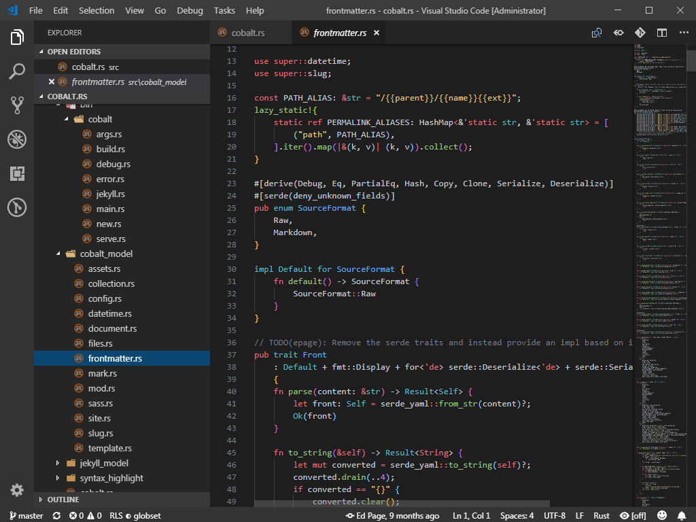

# About
VSCode Dark+ colours with Joshua Azemoh's One Monokai syntax colours.

# Changelog
- 0.2.0: activate semantic highlighting
- 0.1.1: Integrate latest version of token colors from One Monokai
- 0.1.0: Initial release